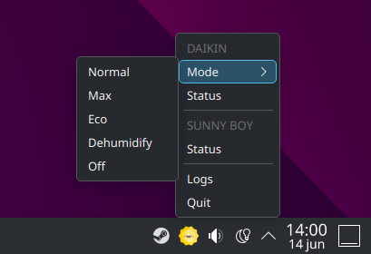
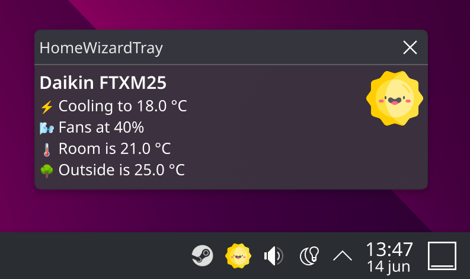

# HomeWizardTray

System tray application showing device information and sensor readouts from my Daikin FTXM25, SMA Sunny Boy and HomeWizard P1 meter.

## External dependencies

- notify-send (shows device info notifications on linux)

## Screenshots

