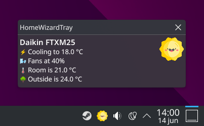

# HomeWizardTray

System tray application for Linux showing device information and sensor readouts from my Daikin FTXM25, SMA Sunny Boy and HomeWizard P1 meter.

## External dependencies

- GtkSharp (context menu)
- libayatana-appindicator (system tray icon) https://github.com/AyatanaIndicators/libayatana-appindicator
- notify-send (shows device information)

## Screenshots

